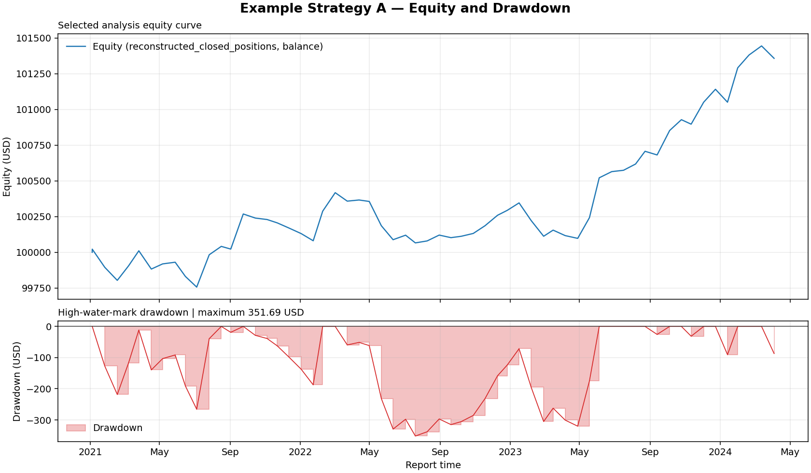
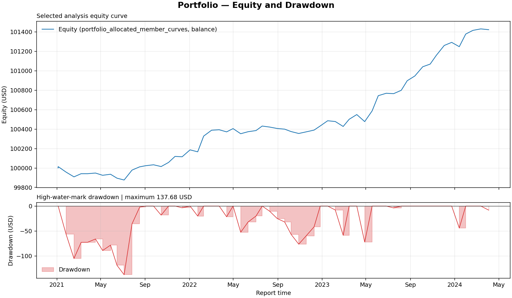
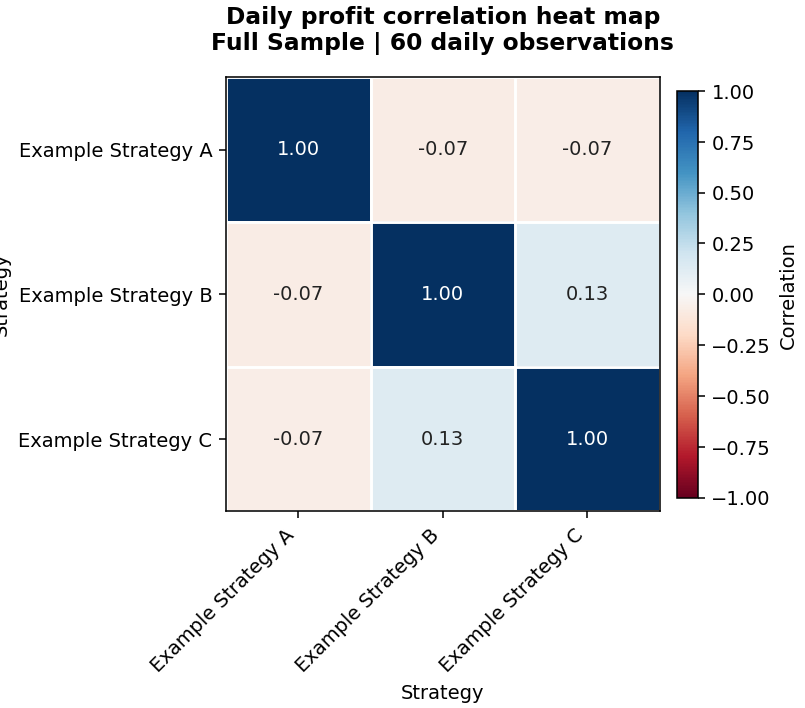
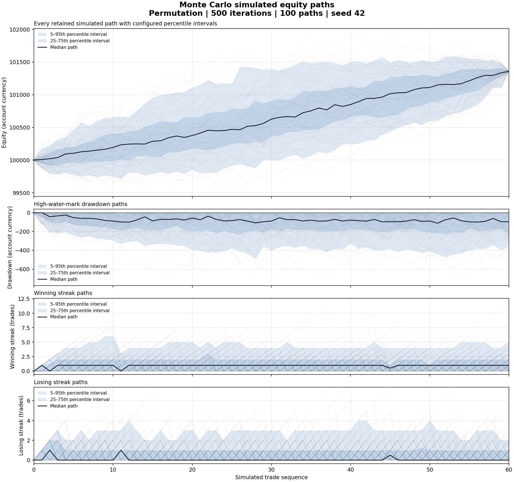

**Agent-native API to analyse and construct portfolios of MT5 strategies and backtests.**

**COMING SOON: GUI for users to interact with.**

[Follow my X for more systematic trading strategies and tricks.](https://x.com/SystematicEdge1)

## About

A fast, deterministic Python library for analysing MetaTrader 5 Strategy Tester
reports. It is an analysis platform only: there is no live execution, order
placement, or GUI in the current release.

**Agent-native API. No need to write code yourself: describe or ask your questions
in Claude, Codex, or another capable agent, and it can calculate them for you.**

I got tired of having to manually use QuantAnalyzer because Codex could not use
it automatically. So instead, I found the features I liked and implemented my
own versions of them.

## Questions this API can answer

- **“What if we take only the long trades from this strategy?”**
- **“What does the portfolio of three strategies look like?”**
- **“What are the 95% Monte Carlo estimates of returns?”**
- **“What are the monthly returns and monthly drawdowns?”**
- **“What are the profit factor, recovery factor, Calmar ratio, and Sharpe?”**
- **“What if every trade risks 1% of a $100,000 account?”**
- **“How correlated are the strategies’ daily profits?”**
- **“How did the strategy perform in-sample versus out-of-sample?”**
- **“Can I compare an XML report with its HTML equivalent?”**

## Quick start

```bash
git clone https://github.com/sushiix-trader/trade-analyser-tools.git
cd trade-analyser-tools && pip install -e ".[charts]"
```

See the [API usage guide](docs/usage.md) for the complete workflow.

## Inputs

The platform currently accepts single-run MetaTrader 5 Strategy Tester reports:

- MT5 HTML reports: `.htm` and `.html`
- MT5 XML reports: `.xml`
- Filesystem paths, bytes, and file-like objects

HTML and XML reports are normalized into the same canonical completed-position
model. Use `compare_reports()` when you need to verify that two files represent
the same report. Optimization workbooks, account-history exports outside the
supported report format, and unhydrated Git LFS pointers are rejected.

## Outputs

The API returns typed, eager, deterministic results. Human-facing example tables
and reports in [`results/`](results/README.md) display numeric values to **2
decimal places**.

Text and table examples:

- [Metrics and ratios](results/analysis.md)
- [Metrics CSV](results/metrics.csv)
- [Rounded JSON result](results/analysis.json)
- [Monthly returns](results/monthly.csv)
- [Monthly drawdown](results/monthly-drawdown.csv)
- [Year × Jan-Dec × compounded YTD performance](results/monthly-performance.csv)
- [Long-only analysis](results/long-only.md)
- [Flat-lot what-if analysis](results/what-if-flat-lot.md)
- [In-sample/out-of-sample analysis](results/sample-periods.md)
- [Portfolio report](results/portfolio.md)
- [Daily profit correlation table](results/daily-profit-correlation.csv)
- [Monte Carlo p5/p50/p95 summary](results/monte-carlo-summary.md)

### Example: returns broken down by month

The eager `monthly_performance` result exposes a year-by-month return matrix.
Values are percentages and `YTD` is compounded from the active months in that
calendar year. The following uses only the public API and formats the result as
a readable table:

```python
from analyser import AnalysisConfig, analyze_file

result = analyze_file("tester_report.htm", AnalysisConfig())
table = result.monthly_performance

def display(value):
    return "—" if value is None else f"{value:.2f}%"

headers = ("Year", *table.month_labels, "YTD")
print("| " + " | ".join(headers) + " |")
print("| " + " | ".join(["---:"] * len(headers)) + " |")
for row in table.rows:
    values = [display(value) for value in row.monthly_returns_pct]
    print("| " + " | ".join((str(row.year), *values, display(row.ytd_return_pct))) + " |")
```

Example output:

```text
| Year | Jan | Feb | Mar | Apr | May | Jun | Jul | Aug | Sep | Oct | Nov | Dec | YTD |
| ---: | ---: | ---: | ---: | ---: | ---: | ---: | ---: | ---: | ---: | ---: | ---: | ---: | ---: |
| 2021 | -0.10% | -0.09% | 0.21% | -0.13% | 0.05% | -0.10% | 0.15% | 0.06% | 0.23% | -0.03% | -0.03% | -0.03% | 0.17% |
| 2022 | -0.09% | 0.21% | 0.07% | -0.00% | -0.17% | -0.10% | -0.02% | 0.05% | -0.02% | 0.03% | 0.05% | 0.11% | 0.12% |
| 2023 | 0.05% | -0.23% | 0.04% | -0.06% | 0.15% | 0.32% | 0.01% | 0.13% | -0.03% | 0.25% | -0.03% | 0.24% | 0.85% |
| 2024 | 0.15% | 0.09% | 0.06% | -0.09% | — | — | — | — | — | — | — | — | 0.21% |
```

Visual examples:

[](results/equity-drawdown.png)

[](results/portfolio-equity-drawdown.png)

[](results/daily-profit-correlation.png)

[](results/monte-carlo-paths.png)

The API also exposes balance/equity curves, validation, warnings, provenance,
JSON/Markdown/CSV serializers, deterministic cache artifacts, portfolio
matrices, covariance, and winning/losing streak distributions. See the
[complete example index](results/README.md).

For installation and end-to-end API workflows, use the separate
[API usage guide](docs/usage.md).

## How to view outputs remotely via Telegram

Telegram delivery is a transport layer around the analyser; it does not change
or recalculate the analysis. The analyser creates the message text and chart or
report files, and the Telegram Bot API delivers them to your private chat or
group. The repository does not currently include a built-in Telegram sender.

### 1. Create a Telegram bot

1. Open Telegram and start a chat with **@BotFather**.
2. Send `/newbot`.
3. Choose a display name and a unique username ending in `bot`.
4. Copy the bot token returned by BotFather.
5. Treat the token like a password. Do not put it in source code, README files,
   reports, screenshots, or Git history.

### 2. Set the credentials as environment variables

Set these in the shell or service that runs the analysis:

```bash
export TELEGRAM_BOT_TOKEN="paste-the-token-here"
export TELEGRAM_CHAT_ID="your-chat-or-group-id"
```

Using environment variables keeps the token out of the repository. If you use a
local `.env` file instead, add `.env` to `.gitignore` before creating it and
never commit the file.

### 3. Find the destination chat ID

1. Open the new bot in Telegram.
2. Send it `/start` from the account or group that should receive reports.
3. Query the bot updates:

```bash
curl -sS \
  "https://api.telegram.org/bot${TELEGRAM_BOT_TOKEN}/getUpdates"
```

4. Find the `chat.id` value in the response and set it as
   `TELEGRAM_CHAT_ID`.

For a group, add the bot to the group first and send a message in that group.
Group IDs are commonly negative numbers. Keep the complete value, including the
minus sign.

### 4. Test the connection

```bash
curl --fail-with-body -sS \
  "https://api.telegram.org/bot${TELEGRAM_BOT_TOKEN}/getMe"

curl --fail-with-body -sS -X POST \
  "https://api.telegram.org/bot${TELEGRAM_BOT_TOKEN}/sendMessage" \
  --data-urlencode "chat_id=${TELEGRAM_CHAT_ID}" \
  --data-urlencode "text=Trade analyser Telegram connection is working."
```

Both commands should return JSON containing `"ok":true`.

### 5. Create analyser outputs

Use the canonical analyser API first. Do not recalculate metrics in the Telegram
transport layer:

```python
from analyser import AnalysisConfig, analyze_file, save_equity_drawdown_chart

result = analyze_file("tester_report.htm", AnalysisConfig())
save_equity_drawdown_chart(result, "/tmp/equity-drawdown.png")

message = result.to_markdown()
with open("/tmp/analysis.md", "w", encoding="utf-8") as output:
    output.write(message)
```

The same pattern applies to portfolio correlation heat maps and Monte Carlo path
charts: generate them with `save_correlation_heatmap()` or
`save_monte_carlo_paths()` and then deliver the resulting files.

### 6. Send a message and charts

Telegram messages are limited in length, so send a concise summary as a message
and the complete Markdown/JSON report as a document:

```bash
curl --fail-with-body -sS -X POST \
  "https://api.telegram.org/bot${TELEGRAM_BOT_TOKEN}/sendMessage" \
  --data-urlencode "chat_id=${TELEGRAM_CHAT_ID}" \
  --data-urlencode "text=Analysis complete. Equity chart and full report attached."

curl --fail-with-body -sS -X POST \
  "https://api.telegram.org/bot${TELEGRAM_BOT_TOKEN}/sendPhoto" \
  -F "chat_id=${TELEGRAM_CHAT_ID}" \
  -F "photo=@/tmp/equity-drawdown.png" \
  -F "caption=Equity and drawdown"

curl --fail-with-body -sS -X POST \
  "https://api.telegram.org/bot${TELEGRAM_BOT_TOKEN}/sendDocument" \
  -F "chat_id=${TELEGRAM_CHAT_ID}" \
  -F "document=@/tmp/analysis.md" \
  -F "caption=Full deterministic analysis report"
```

For a portfolio, send the equity/drawdown chart, correlation heat map, and
portfolio Markdown report in the same way. For Monte Carlo, send the path chart
and the summary report. The Telegram layer should preserve the analysis
configuration, warnings, and provenance alongside the files so the result can
be reproduced later.

### Security checklist

- Keep `TELEGRAM_BOT_TOKEN` outside the repository and deployment logs.
- Never print the token in diagnostic output.
- Restrict the bot to a private chat or controlled group.
- Revoke and regenerate the token with BotFather if it is exposed.
- Do not send reports containing confidential strategy names or data to a chat
  that is not controlled by you.
- Telegram delivery is for viewing analysis outputs only; it does not enable
  live trading or execution.

## Metric conventions

- `profit_factor` = gross profit / absolute gross loss.
- `recovery_factor` = net profit / maximum drawdown in money.
- `return_drawdown_ratio` = total return percentage / maximum drawdown percentage.
- `calmar_ratio` = CAGR / maximum drawdown percentage.
- `custom_trade_event_sharpe` is an unannualized Sharpe calculated from
  completed-trade events.
- `daily_sharpe_ratio` uses reconstructed calendar end-of-day equity and keeps
  flat no-trade days.
- `annualized_daily_sharpe_ratio` applies the configured daily annualization
  factor, defaulting to `365.2425` for the calendar-day series.
- Bars-per-trade and R-expectancy metrics are `None` with diagnostics unless
  the required optional inputs are supplied.
- Reported MT5 metrics remain separate from metrics recalculated by this API.

Undefined values are returned as `None`/JSON `null` with a structured warning
rather than being guessed or silently converted to infinity.

## Development

Run the test suite with:

```bash
python3 -m unittest discover -s tests -v
```

The full agent workflow and canonical API routing instructions are in
[`.agents/skills/mt5-report-analysis/SKILL.md`](.agents/skills/mt5-report-analysis/SKILL.md).

## License

This project is released under the [MIT License](LICENSE). The current package
version is **0.1.0**.
