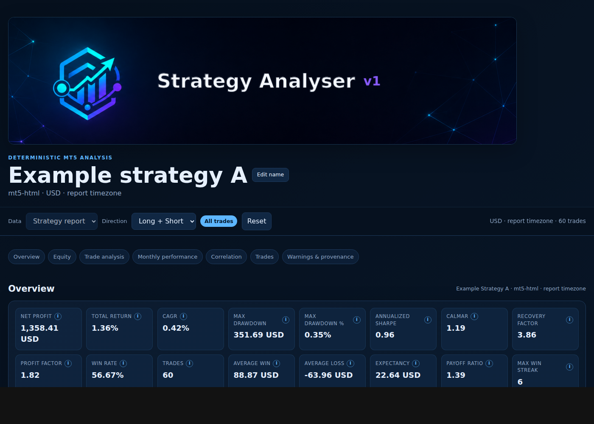
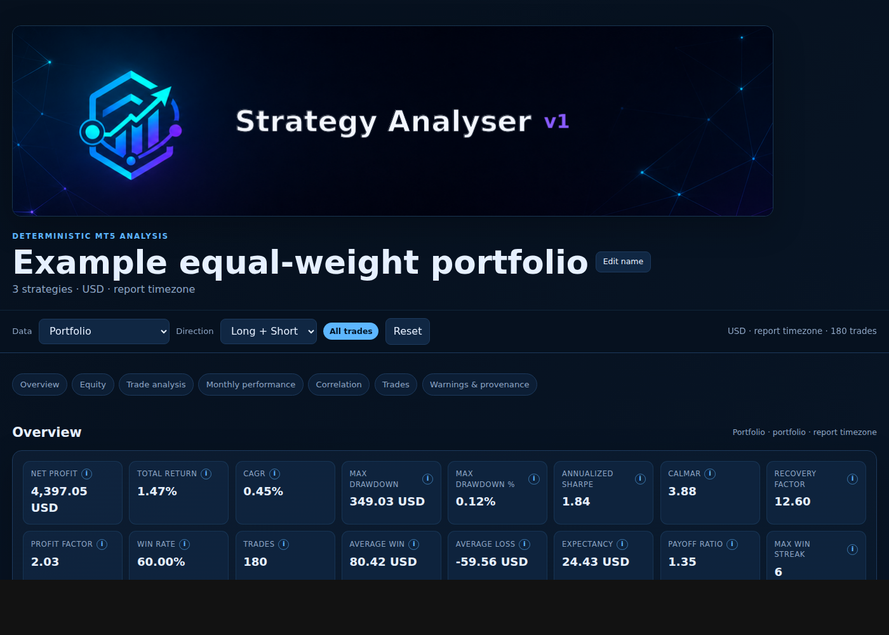
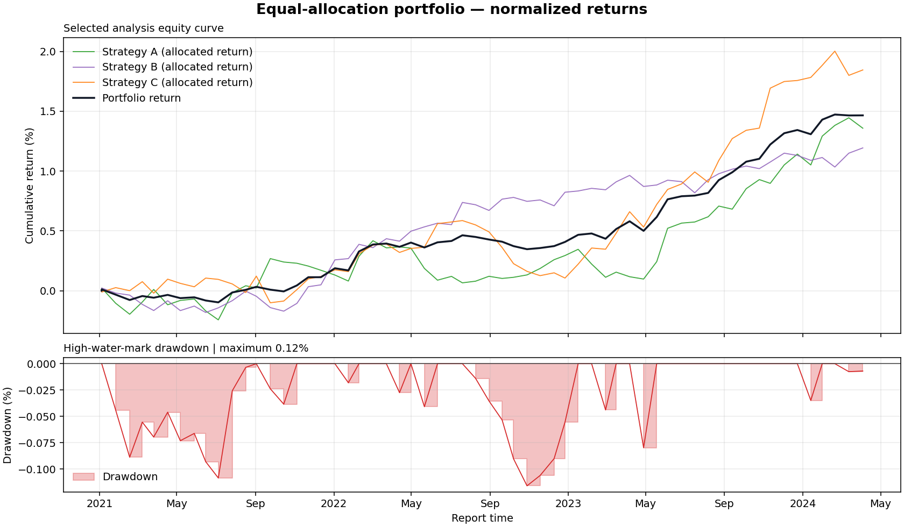
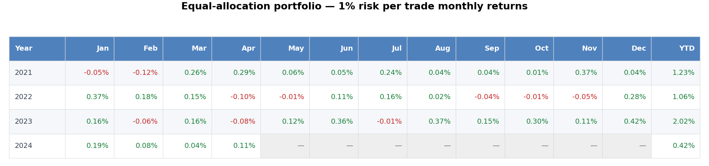
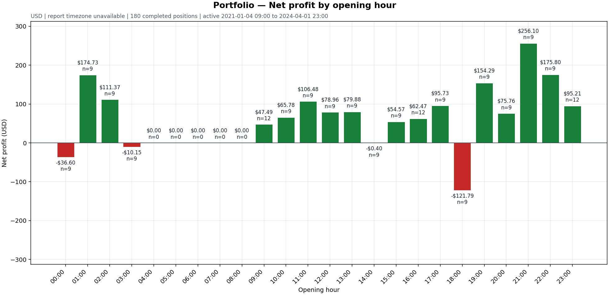

# Example results

These artifacts were generated through the public `analyser` API from a local
MT5 report that was used only as a structural template. The committed fixture
contains deterministic synthetic data: strategy names, symbols, inputs,
comments, identifiers, timestamps, prices, and P&L were replaced or scrambled.
It is not a real trading result. Human-facing Markdown and CSV values are
formatted to 2 decimal places; the API's in-memory values remain available for
analysis and reproducibility.

Source reports:

- [Sanitized single report](sample_reports/example_strategy_a.html)
- [Sanitized portfolio report B](sample_reports/example_strategy_b.html)
- [Sanitized portfolio report C](sample_reports/example_strategy_c.html)

Single-report outputs:

- [Metrics and monthly Markdown](analysis.md)
- [Rounded deterministic JSON](analysis.json)
- [Metrics CSV](metrics.csv)
- [Monthly returns CSV](monthly.csv)
- [Monthly drawdown CSV](monthly-drawdown.csv)
- [Year/month/YTD performance CSV](monthly-performance.csv)
- [Equity and drawdown chart](equity-drawdown.png)
- [Long-only result](long-only.md)
- [Flat-lot what-if result](what-if-flat-lot.md)
- [In-sample/out-of-sample result](sample-periods.md)
- [Interactive single-report webpage](interactive-report.html)

Portfolio outputs:

- [Portfolio Markdown report](portfolio.md)
- [Portfolio allocated equity CSV](portfolio-equity.csv)
- [Portfolio equity and drawdown chart](portfolio-equity-drawdown.png)
- [Portfolio equity with individual strategy curves](portfolio-equity-with-strategies.png)
- [Equal-allocation normalized portfolio curves](portfolio-equity-with-strategies-equal-percent.png)
- [Monthly performance table image](portfolio-what-if-1pct-monthly-performance.png)
- [Daily profit correlation table](daily-profit-correlation.csv)
- [Daily profit correlation heat map](daily-profit-correlation.png)
- [Equal-weight portfolio interactive webpage](interactive-portfolio-report.html)
- [Equal-weight portfolio rendered preview](interactive-portfolio-report-preview.png)
- [Trade-profit bar chart examples](trade-profit-bars/README.md)

The interactive portfolio page combines the three sanitized example reports
with equal raw weights (`1.0` each), normalized to one-third allocations and a
`$300,000` portfolio initial capital. It includes the combined metrics,
filterable member curves, monthly return/drawdown heat maps, trade analysis,
and daily profit-correlation matrix. Its **Edit name** control changes only
presentation metadata and persists the chosen name in the shareable URL
fragment.

Monte Carlo outputs:

- [Monte Carlo p5/p50/p95 summary](monte-carlo-summary.md)
- [Monte Carlo simulated paths](monte-carlo-paths.png)

Visual outputs:

